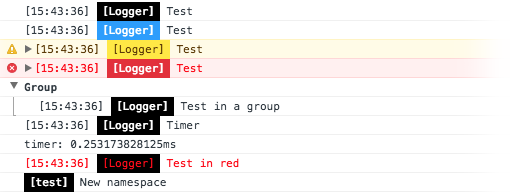

# [](https://github.com/fm-ph/quark-log)

[![build status][travis-image]][travis-url]
[![stability][stability-image]][stability-url]
[![npm version][npm-image]][npm-url]
[![js-standard-style][standard-image]][standard-url]
[![semantic-release][semantic-release-image]][semantic-release-url]

Simple configurable logging module.

___This package is part of `quark` framework but it can be used independently.___



## Features

- **Levels** : Defaults (`log`, `info`, `warn`, `error`) and custom
- **Plugins** : Defaults and custom
- **Styling** : Per level/plugin
- **More** : Timer, group, reset...

## Installation

[](https://www.npmjs.com/package/quark-log)

```sh
npm install quark-log --save
```

## Usage

### Basic

```js
import { Logger } from 'quark-log'

const logger = new Logger()

logger.log('Test')
logger.log('Test', { test: true })
logger.log('Test', 10, true)
```

#### Enable/disable logging

```js
import { Logger } from 'quark-log'

const logger = new Logger()

logger.off()
logger.log('This test will not be logged')
logger.on()
```

#### Grouping

```js
import { Logger } from 'quark-log'

const logger = new Logger()

logger.group('Group')
logger.log('Test grouping')
logger.groupEnd()
```

#### Timer

```js
import { Logger } from 'quark-log'

const logger = new Logger()

logger.time('timer')
// ...
logger.timeEnd('timer')
```

#### Handler

```js
import { Logger } from 'quark-log'

const logger = new Logger()

logger.setHandler(msgs => {
  // msgs = ['Test', true]
})

logger.log('Test', true)
```

#### Reset

Reset levels and plugins.

```js
import { Logger, plugins } from 'quark-log'

const logger = new Logger()
logger.plugin('time', plugins.time)

logger.log('Test') // [15:00:00] Test
logger.reset()
logger.log('Test') // Test
```

#### Line break

```js
import { Logger } from 'quark-log'

const logger = new Logger()
logger.br()
```

### Levels

#### Defaults levels

```js
import { Logger } from 'quark-log'

const logger = new Logger()
logger.log('Log')
logger.info('Info')
logger.warn('Warn')
logger.error('Error')
```

#### Add a custom level

```js
import { Logger } from 'quark-log'

const logger = new Logger()
logger.level('custom')

logger.custom('My custom level')
```

#### Configure level options

```js
import { Logger } from 'quark-log'

const logger = new Logger()
logger.level('custom', {
  styles: {
    color: 'blue'
  }
})

logger.custom('Test') // Will be logged in blue
```

### Plugins

#### Defaults plugins list

- [**time**](./src/plugins/time.js) : Append current time before user message
- [**namespace**](./src/plugins/namespace.js) : Append a custom namespace before user message

#### Use a default plugin

```js
import { Logger, plugins } from 'quark-log'

const logger = new Logger()
logger.plugin('time', plugins.time)

logger.log('Test') // [15:00:00] Test
```

#### Configure plugin options

```js
import { Logger, plugins } from 'quark-log'

const logger = new Logger()
logger.plugin('namespace', plugins.namespace, { name: 'test' })
logger.log('Test') // [test] Test

logger.plugin('namespace', { enabled: false })
logger.log('Test') // Test
```

#### Create a custom plugin

```js
import { Logger } from 'quark-log'

/**
 * Plugin callback signature
 * 
 * @param {Array} msgs User messages
 * @param {Object} options Plugin options
 * @param {Object} level Level
 * @param {String} level.name Level name
 * @param {Object} level.options Level options
 */
const myPlugin = (msgs, options, level) => {
  return { before: `${options.myOption}:`, msgs, after: '', styles: {} }
}

const logger = new Logger()
logger.plugin('myPlugin', myPlugin, { myOption: 'My plugin' }) // This plugin append a custom string before each message

logger.log('Test') // My plugin: Test
```

## API

See [https://fm-ph.github.io/quark-log/](https://fm-ph.github.io/quark-log/)

## Build

To build the sources with `babel` in `./lib` directory :

```sh
npm run build
```

## Documentation

To generate the `JSDoc` :

```sh
npm run docs
```

To generate the documentation and deploy on `gh-pages` branch :

```sh
npm run docs:deploy
```

To serve the `JSDoc` :

```sh
npm run docs:serve
```

## Testing

To run the tests, first clone the repository and install its dependencies :

```sh
git clone https://github.com/fm_ph/quark-log.git
cd quark-log
npm install
```

Then, run the tests :

```sh
npm test
```

To watch (test-driven development) :

```sh
npm run test:watch
```

For coverage :

```sh
npm run test:coverage
```

## License

MIT [License](LICENSE.md) © [Patrick Heng](http://hengpatrick.fr/) [Fabien Motte](http://fabienmotte.com/) 

[travis-image]: https://img.shields.io/travis/fm-ph/quark-log/master.svg?style=flat-square
[travis-url]: http://travis-ci.org/fm-ph/quark-log
[stability-image]: https://img.shields.io/badge/stability-stable-brightgreen.svg?style=flat-square
[stability-url]: https://nodejs.org/api/documentation.html#documentation_stability_index
[npm-image]: https://img.shields.io/npm/v/quark-log.svg?style=flat-square
[npm-url]: https://npmjs.org/package/quark-log
[standard-image]: https://img.shields.io/badge/code%20style-standard-brightgreen.svg?style=flat-square
[standard-url]: https://github.com/feross/standard
[semantic-release-image]: https://img.shields.io/badge/%20%20%F0%9F%93%A6%F0%9F%9A%80-semantic--release-e10079.svg?style=flat-square
[semantic-release-url]: https://github.com/semantic-release/semantic-release
